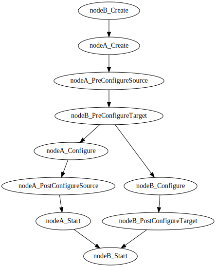

# Node instanciation lifecycle

## Abstract
At runtime, the node template must be instanciated according its lifecycle.
Moreover the creation of the node linked via simple relationship or via special type [tosca.interfaces.Relationship.Configure](http:docs.oasis-open.org/tosca/TOSCA-Simple-Profile-YAML/v1.0/csd03/TOSCA-Simple-Profile-YAML-v1.0-csd03.html#DEFN_TYPE_ITFC_RELATIONSHIP_CONFIGURE) may have a special lifecycle execution conditionned by the execution of the source node.

## Algorithm
Suppose nodeA and nodeB where nodeA requires nodeB

if nodeA and nodeB has a Configure relationship, then the workflow represented in [dot formalism](http://www.graphviz.org) is:
```dot
digraph WorkflowStart {
    nodeB:Create() -> nodeA:Create()
    nodeA:Create() -> nodeA:PreConfigureSource()
    nodeA:PreConfigureSource -> nodeB:PreConfigureTarget()
    nodeB:PreConfigureTarget -> nodeA:Configure()
    nodeB:PreConfigureTarget -> nodeB:Configure()
    nodeA:Configure() -> nodeA:PostConfigureSource()
    nodeB:Configure() -> nodeB:PostConfigureTarget()
    nodeA:PostConfigureSource() -> nodeA:Start()
    nodeB:PostConfigureTarget() -> nodeB:Start()
    nodeA:Start() -> nodeB:Start()
}
```

Which leads to this graph: 

otherwise the workflow is:
```dot
   digraph WorkflowStart {
         nodeB:Create() -> nodeB:Configure() -> nodeB:Start() -> nodeA:Create() -> nodeA:Configure() -> nodeA:Start()
   }
```

Let's consider N _tosca node templates_ definitions in the service file; therefore the number of nodes in the graph is K= Nx10 because every NodeTemplate has 10 associated nodes:
* Initial
* Create
* PreConfigureSource
* PreConfigureTarget
* Configure
* PostConfigureSource
* PostConfigureTarget
* Start
* Stop
* Delete

## Implementation

The graph of the workflow is described via a _KxK_ [Adjacency matrix](https://en.wikipedia.org/wiki/Adjacency_matrix)


